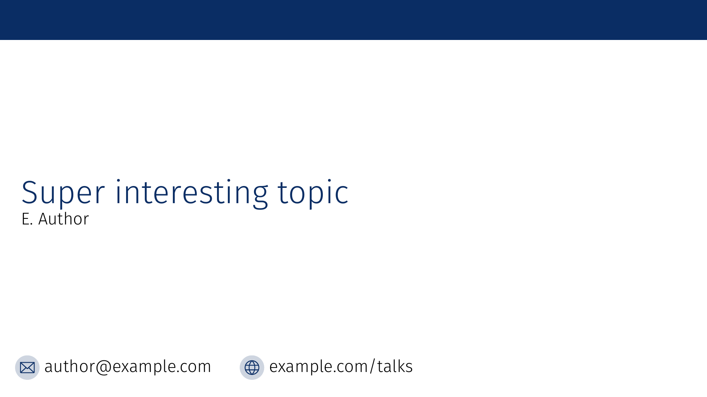
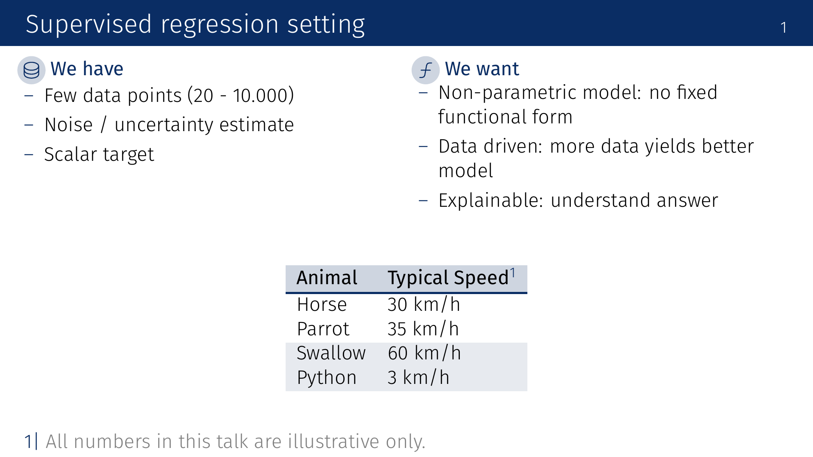
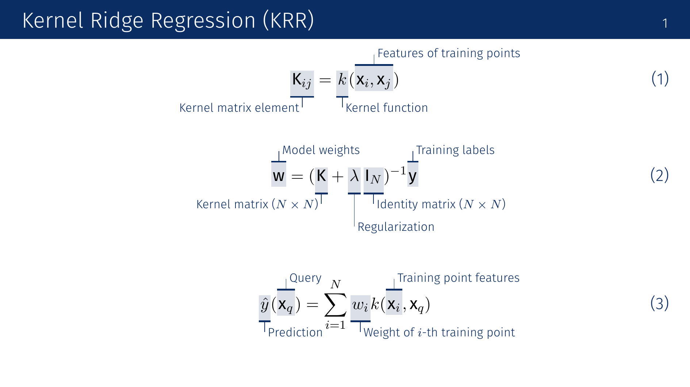
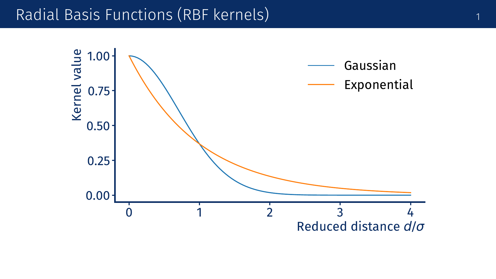
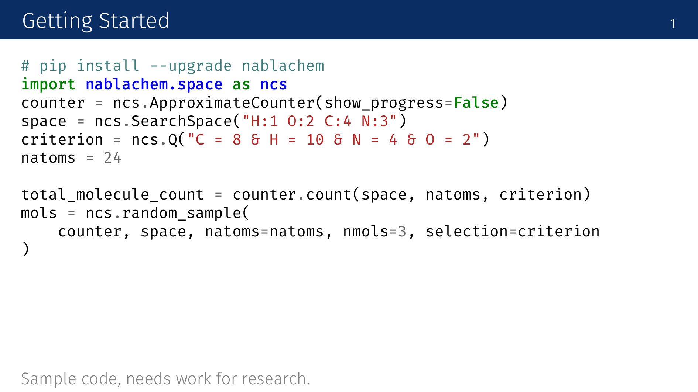
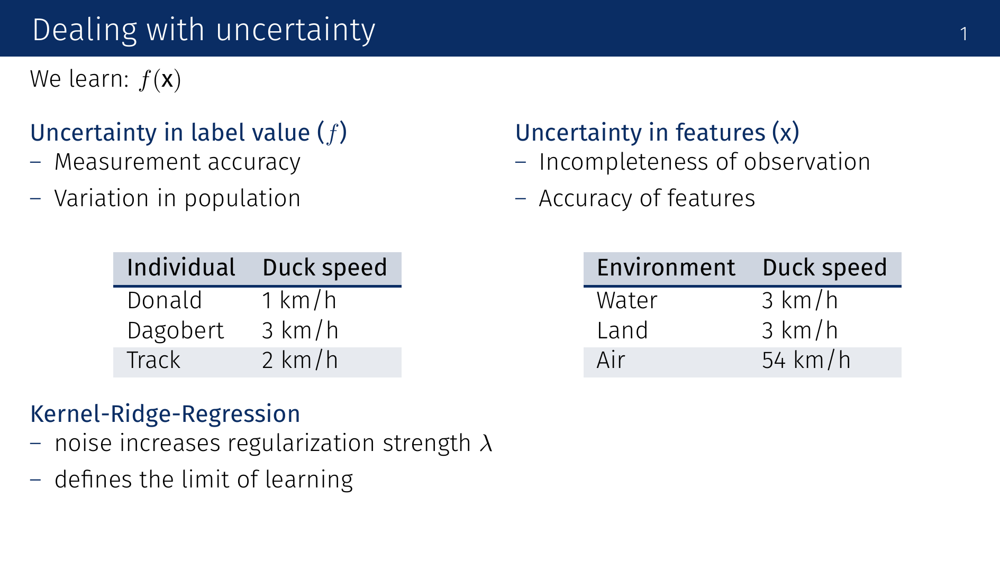
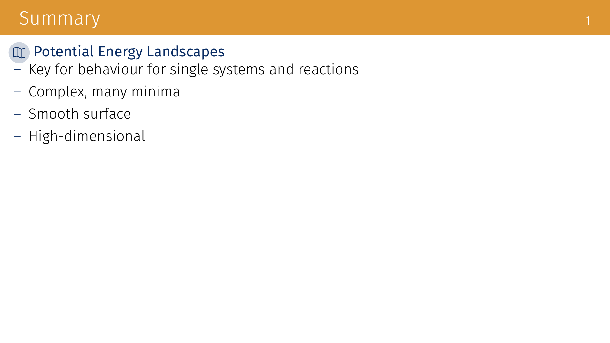

# AutoSlide

Presentation slides in markdown, converted to LaTeX Beamer with automatic annotations for equations.

## Installation

```bash
pip install click matplotlib numpy tqdm cairosvg pygments
```

Requirements:
- Python 3.x
- XeLaTeX (via TeX Live or similar)
- latexmk
- Fira Sans font

## Usage

```bash
$ python -m autoslide.cli lecture.md
Parsed 15 slides
Generating 8 figures...
Generating figures: 100%|██████████| 8/8 [00:12<00:00,  1.5s/figure]
Generated lecture-autoslide/lecture.tex
Compiling LaTeX to PDF...
LaTeX compilation successful
PDF copied to lecture.pdf
```

AutoSlide creates an output directory, generates LaTeX, compiles to PDF, and copies the result back.

## Examples

### Title Page



[→ Source](examples/example-01-titlepage.md)

### Section Slide


[→ Source](examples/example-02-section.md)

### Two-Column Layout with Icons and Table



[→ Source](examples/example-03-twocolumns.md)

### Annotated Equations



[→ Source](examples/example-04-equations.md)

### Matplotlib Plots



[→ Source](examples/example-05-plot.md)

### Code Blocks



[→ Source](examples/example-06-code.md)

### Section Breaks



[→ Source](examples/example-07-sectionbreaks.md)

### Summary Slide



[→ Source](examples/example-08-summary.md)

## Syntax Reference

### Slide Types

- `##### Title #####` - Title page
- `## Section` - Section slide
- `### Slide Title` - Regular slide
- `### !Hidden` - Hidden slide
- `### ?Summary` - Summary slide with orange header

### Layout

- `-|-` - Column break
- `---` - Section break within columns

### Content

- `$$ equation $$` with `[[ term ]] explanation` - Annotated equations
- `:::image.pdf: Caption` - Images
- ````plot: Caption` - Matplotlib plots with axes
- ````schematic: Caption` - Matplotlib diagrams without tick marks
- ````language` - Syntax-highlighted code
- `| Header |` - Tables
- `[1] Text` - Numbered footnote
- `[*] Text` - Unnumbered footnote
- `// Comment` - Ignored
- `># file.md` - Include file
- `:icon:` - Icons in headings, https://phosphoricons.com/

## Command Options

- `--no-cache` - Regenerate all figures

## Output

Generated presentations use a custom beamer theme with navy blue accents.
