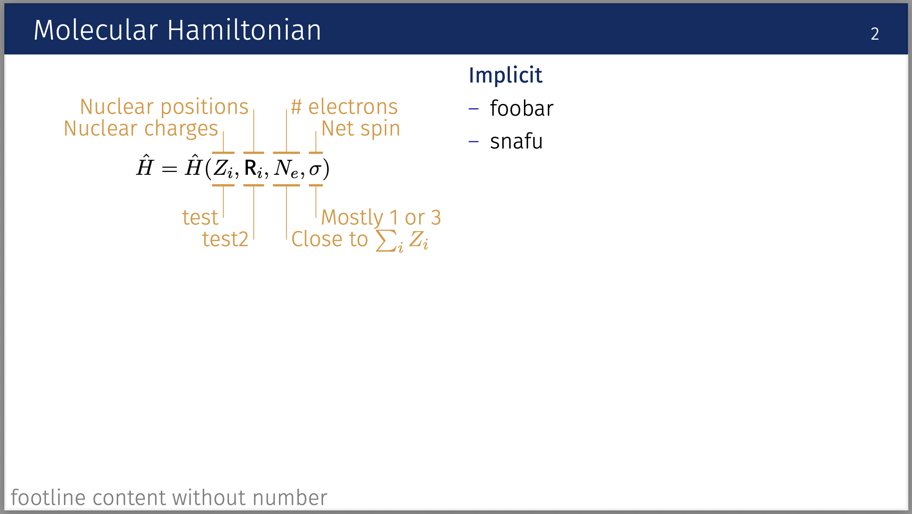

# AutoSlide

A tool to convert Markdown presentations to LaTeX Beamer slides.

## Overview

AutoSlide converts a custom Markdown syntax into LaTeX Beamer presentations. The tool parses Markdown files with special syntax for slides, sections, equations, images, and annotations, then generates LaTeX code that can be compiled with LuaLaTeX.

## Usage

```bash
# Convert markdown to LaTeX
python render.py examples/test.md > slides.tex

# Compile to PDF
latexmk -lualatex slides.tex
```

### Progress Output

AutoSlide provides progress feedback during processing:

```bash
$ python render.py examples/test.md > slides.tex
Parsed 15 slides
Generating 8 figures...
Generating figures: 100%|██████████| 8/8 [00:12<00:00,  1.5s/figure]
```

- **Progress messages** are sent to stderr (visible in terminal but not in piped output)
- **LaTeX code** is sent to stdout (clean for file redirection)
- **Progress bar** shows real-time figure generation with ETA and timing

## Markdown Syntax

The tool supports a custom Markdown syntax for presentations:

- `## Section Title` - Creates section slides
- `### Slide Title` - Creates regular slides
- `### !Hidden Title` - Creates hidden slides
- `### ?Summary Title` - Creates section summary slides with orange title bar
- `-|-` - Column break for two-column layouts
- `$$ equation $$` - Math equations with annotations (see detailed syntax below)
- `:::image.pdf: Caption` - Images with captions
- ````plot: Caption` - Generate matplotlib plots with axis labels and tick marks
- ````schematic: Caption` - Generate matplotlib diagrams with axis labels but no tick marks
- `[1] Footnote text` - Footnotes with numbers
- `[*] Footnote without number`
- `// Comment text` - Comments (ignored during parsing)
- Standard Markdown lists and text

## Annotated Math Equations

AutoSlide supports a powerful syntax for annotating mathematical equations. This allows you to highlight specific parts of equations and add explanatory text above or below them.

### Basic Syntax

1. **Write your equation** using standard LaTeX math syntax within `$$ ... $$`
2. **Add a dash line** on the next line to mark which parts to annotate
3. **Specify annotations** using position markers with `^` (above) or `v` (below)

### Example

```markdown
$$\hat{H} = \hat{H}(Z_i, \mathbf{R}_i, N_e, \sigma)$$
                    ---  ------------  ---  ------
1^ Nuclear charges
2^ Nuclear positions  
3^ Number of electrons
4^ Net spin
3v Close to $\sum_i Z_i$
4v Mostly 1 or 3
```

### Annotation Rules

- **Dash positioning**: Use dashes (`---`) under the equation parts you want to annotate
- **Annotation markers**:
  - `N^` places annotation **above** the equation (where N is the position number)
  - `Nv` places annotation **below** the equation (where N is the position number)
- **Position numbering**: Numbers correspond to the order of dash segments from left to right
- **Text formatting**: Annotations support LaTeX math syntax like `$\sum_i Z_i$`

### Layout

- Left annotations (positions 1, 2) are right-aligned
- Right annotations (positions 3, 4+) are left-aligned  
- Multiple annotations create a pyramid-like layout for better readability
- Above and below annotations are automatically spaced to avoid overlap

## Matplotlib Code Blocks

AutoSlide can generate figures on-the-fly using matplotlib. Code blocks are executed in isolated Python environments with automatic imports.

### Syntax

````markdown
```plot: Optional caption text
plt.plot([1, 2, 3], [1, 4, 9])
plt.xlabel('X values')
plt.ylabel('Y values')
```

```schematic: Diagram caption
plt.plot([0, 1], [0, 1], 'o-')
plt.xlabel('Input')
plt.ylabel('Output')
```
````

### Features

- **Auto-imports**: `numpy as np` and `matplotlib.pyplot as plt` are automatically available
- **Two types**:
  - `plot`: Full plots with axis labels and tick marks
  - `schematic`: Diagrams with axis labels but no tick marks
- **Isolation**: Each code block runs in a separate Python subprocess
- **Font matching**: Uses Fira Sans font to match beamer slides
- **Adaptive sizing**: Figures automatically adjust based on slide layout
- **PDF output**: Generated as `{filename}.figure{N}.pdf` files
- **Progress tracking**: Visual progress bar during figure generation

### Advanced Figure Features

#### Layout-Aware Sizing
AutoSlide automatically detects whether figures appear in single or two-column layouts and adjusts accordingly:

- **Two-column slides**: Compact sizing with square aspect ratios to fit within columns
- **Single-column slides**: Larger widescreen sizing to better fill available space

#### Professional Styling
All generated figures use presentation-optimized styling:

- **Navy blue axes** matching the beamer theme
- **Thick axis lines** for better visibility
- **Large fonts** sized appropriately for presentations
- **Bold markers and lines** for clear data visualization
- **Clean appearance** with minimal visual clutter
- **End-positioned labels** for professional look

#### Smart Generation
- **Deferred processing**: Figures generated after layout analysis is complete
- **Automatic naming**: Sequential PDF files based on input filename
- **Integrated scaling**: LaTeX includes figures with appropriate sizing
- **Progress feedback**: Real-time status during generation

### Error Handling

If Python code execution fails, processing stops with a detailed error message showing the problematic figure, code, and Python error output.

## Requirements

- Python 3.x
- Click library (`pip install click`)
- Matplotlib and NumPy (`pip install matplotlib numpy`)
- tqdm for progress bars (`pip install tqdm`)
- LuaLaTeX for compilation
- Fira Sans font (used in the beamer theme)

## Output

The generated LaTeX uses a custom beamer theme. Customisation / custom templating currently is not supported.



```
### Molecular Hamiltonian ###################################################

$$\hat{H} = \hat{H}(Z_i, \mathbf{R}_i, N_e, \sigma)$$
                    ---  ------------  ---  ------
1^ Nuclear charges
2^ Nuclear positions
3^ \# electrons
4^ Net spin
3v Close to $\sum_i Z_i$
4v Mostly 1 or 3
1v test
2v test2

-|-

Implicit
- foobar
- snafu

[*] footline content without number

```