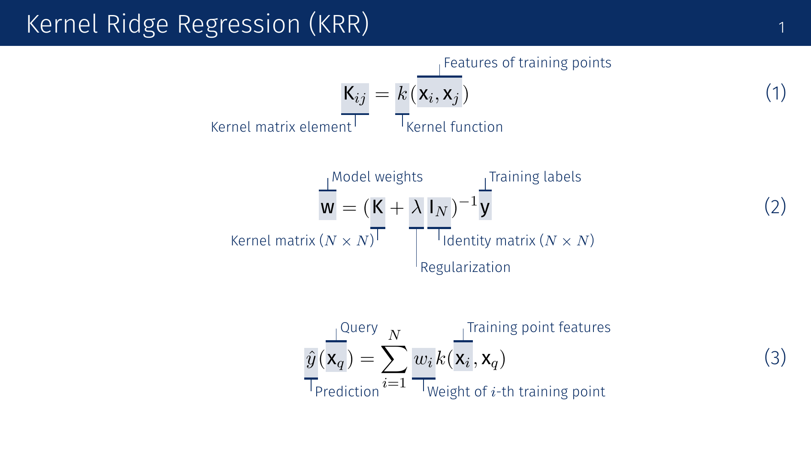
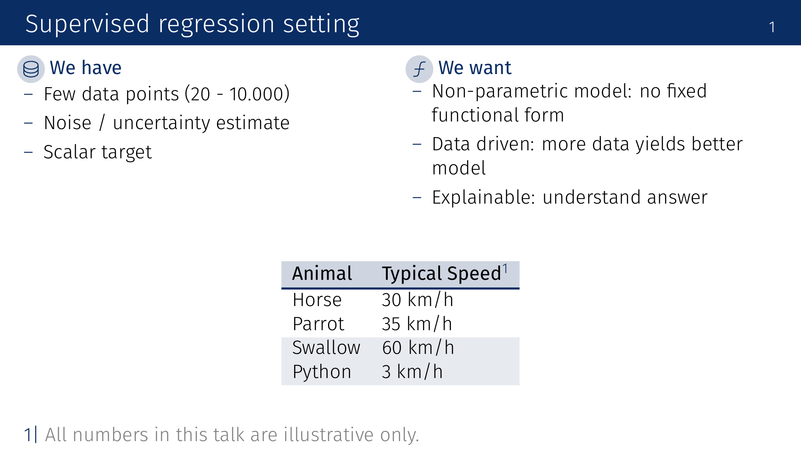
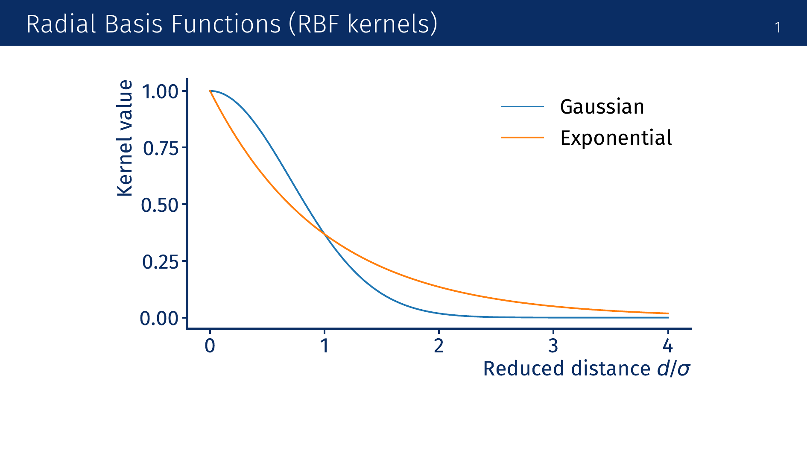
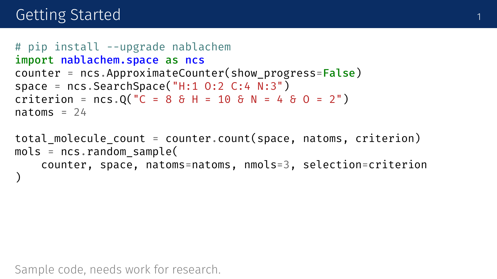
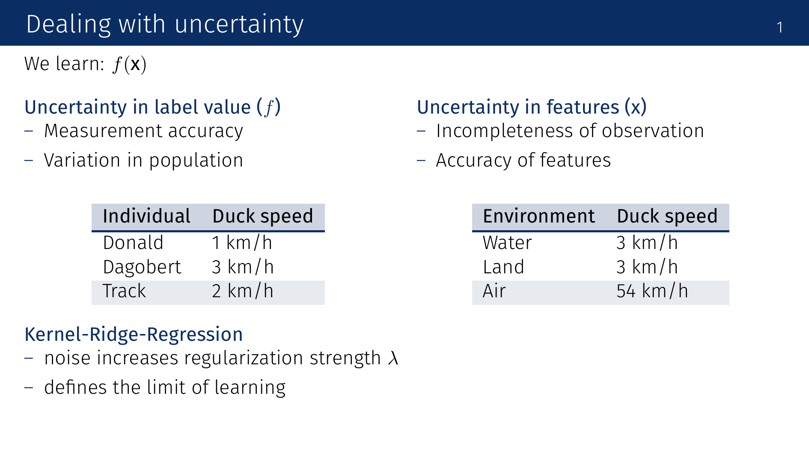
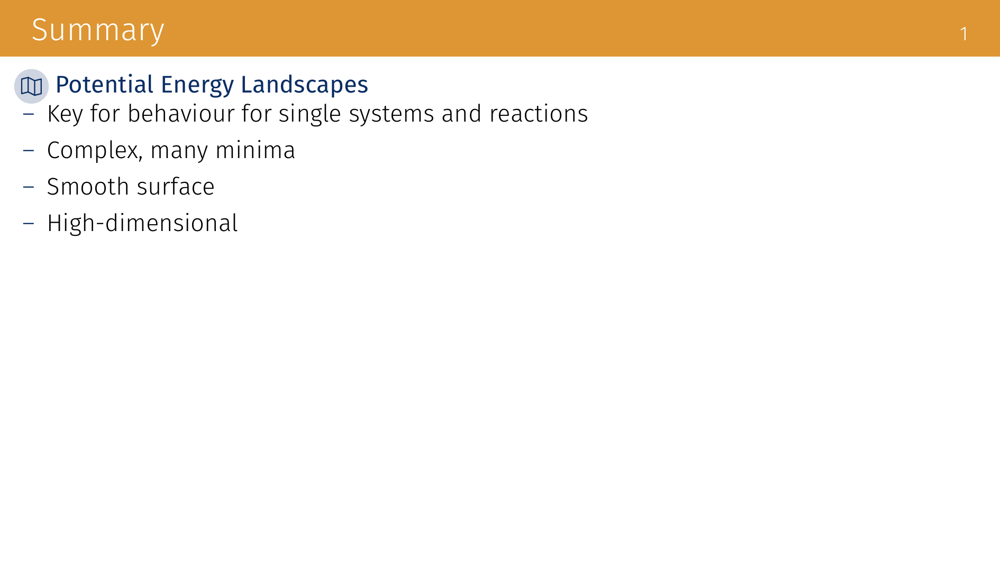

# AutoSlide

Presentation slides in markdown, converted to LaTeX Beamer and then PDF with automatic annotations for equations: all the fun and none of the work! LLM-friendly.



is generated from this:

```markdown
### Kernel Ridge Regression (KRR)

$$\mathbf{K}_{ij} = {k}(\mathbf{x}_i, \mathbf{x}_j)$$
[[ {k} ]] Kernel function
[[ \mathbf{x}_i, \mathbf{x}_j ]] Features of training points
[[ \mathbf{K}_{ij} ]] Kernel matrix element

$$\mathbf{w} = (\mathbf{K} + \lambda\, \mathbf{I}_N)^{-1}\mathbf{y}$$
[[ \mathbf{K} ]] Kernel matrix ($N\times N$)
[[ \mathbf{w} ]] Model weights
[[ \lambda ]] Regularization
[[ \mathbf{I}_N ]] Identity matrix ($N\times N$)
[[ \mathbf{y} ]] Training labels

$$\hat y(\mathbf{x}_q) = \sum_{i=1}^{ N } w_i {k}(\mathbf{x}_i, \mathbf{x}_q)$$
[[ \hat y ]] Prediction
[[ \mathbf{x}_q ]] Query
[[ w_i ]] Weight of $i$-th training point
[[ \mathbf{x}_i ]] Training point features
```


## Examples

### Title Page


[→ Source](examples/example-01-titlepage.md)

### Section Slide


[→ Source](examples/example-02-section.md)

### Two-Column Layout with Icons and Table



[→ Source](examples/example-03-twocolumns.md)

### Annotated Equations


[→ Source](examples/example-04-equations.md)

### Matplotlib Plots



[→ Source](examples/example-05-plot.md)

### Code Blocks



[→ Source](examples/example-06-code.md)

### Section Breaks



[→ Source](examples/example-07-sectionbreaks.md)

### Summary Slide



[→ Source](examples/example-08-summary.md)

## Syntax Reference

### Slide Types

- `##### Title #####` - Title page
- `## Section` - Section slide
- `### Slide Title` - Regular slide
- `### !Hidden` - Hidden slide
- `### ?Summary` - Summary slide with orange header

### Layout

- `-|-` - Column break
- `---` - Section break within columns

### Content

- `$$ equation $$` with `[[ term ]] explanation` - Annotated equations
- `:::image.pdf: Caption` - Images
- ````plot: Caption` - Matplotlib plots with axes
- ````schematic: Caption` - Matplotlib diagrams without tick marks
- ````language` - Syntax-highlighted code
- `| Header |` - Tables
- `[1] Text` - Numbered footnote
- `[*] Text` - Unnumbered footnote
- `// Comment` - Ignored
- `># file.md` - Include file
- `:icon:` - Icons in headings, https://phosphoricons.com/


## Customising the output

All LaTeX comes from Jinja2 templates in `autoslide/templates/`, and every
colour, font and length from the `Theme` in `autoslide/theme.py`. Templates use
LaTeX-safe delimiters: `<% ... %>` for statements, `<< ... >>` for expressions,
`<# ... #>` for comments.

### Overriding a template

Drop a file with the same relative name into a template directory - searched in
this order:

1. `$AUTOSLIDE_TEMPLATES` (`:`-separated list of directories)
2. `autoslide-templates/` next to your markdown file
3. `~/.config/autoslide/templates/`

The built-in versions stay reachable under the `autoslide/` prefix, so an
override usually replaces just one named block:

```jinja
<# my-talk/autoslide-templates/slides/frame.tex.j2 #>
<% extends "autoslide/slides/frame.tex.j2" %>
<% block footnotes %>
\parbox[t]{\textwidth}{\tiny <% include "blocks/footnotes.tex.j2" %>}
<% endblock %>
```

Editing a template invalidates the output cache automatically.

### What each template does

| Template | Renders |
| --- | --- |
| `preamble.tex.j2` | Shared preamble for slides, posters and the annotation-measurement pass. Blocks: `documentclass`, `fonts`, `colors`, `geometry`, `frame_furniture`, `lists`, `footnotes`, `math`, `packages`, `code_styles`, `spacing`, `extra` |
| `slides/document.tex.j2` | The presentation as a whole |
| `slides/frame.tex.j2` | A content slide, including the `?summary` variant |
| `slides/layout.tex.j2` | Sections (`---`) and columns (`-\|-`) |
| `slides/title_page.tex.j2` | Cover slide |
| `slides/section_slide.tex.j2` | Full-bleed divider slide |
| `poster/document.tex.j2`, `poster/layout.tex.j2`, `poster/box.tex.j2` | Poster, its column bands, and one `###` box |
| `blocks/*.tex.j2` | One block each: `list`, `table`, `image`, `equation`, `footnotes`, `icon`, `tracing` |
| `measure/document.tex.j2` | Throwaway document whose log reports annotation geometry |

## Installation

```bash
pip install click jinja2 matplotlib numpy tqdm cairosvg pygments
```

Requirements:
- Python 3.x
- XeLaTeX (via TeX Live or similar)
- latexmk
- Fira Sans font

## Usage

```bash
$ python -m autoslide.cli lecture.md
Parsed 15 slides
Generating 8 figures...
Generating figures: 100%|██████████| 8/8 [00:12<00:00,  1.5s/figure]
Generated lecture-autoslide/lecture.tex
Compiling LaTeX to PDF...
LaTeX compilation successful
PDF copied to lecture.pdf
```

AutoSlide creates an output directory, generates LaTeX, compiles to PDF, and copies the result back.
